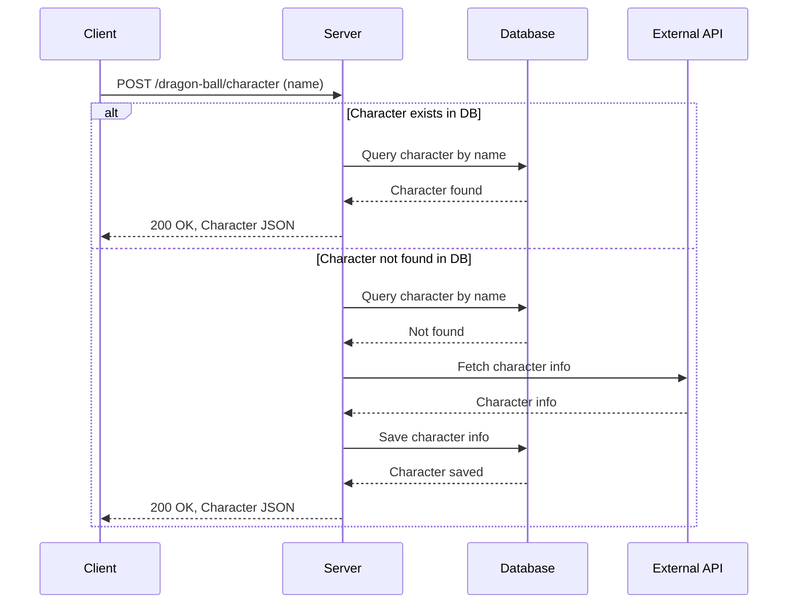

# Dragon Ball API

This project is a small API written in **Go** using the **Gin** framework.  
It manages Dragon Ball character information, fetching data from an external API and storing it in a **SQLite** database (with the possibility to switch to another engine in the future).

---

## 🚀 How to run the project

### 📦 Prerequisites

- Go `>=1.23`
- [Air](https://github.com/air-verse/air) for hot reload (Optional) (v1.61.5 pinned for Go 1.23 compatibility)
- Docker and Docker Compose for running in containers

---

### 🔧 Local environment setup

1. Clone this repository:

```bash
git clone https://github.com/jpjorquera/sample-dball
cd sample-dball
```

2. Install dependencies:

```bash
go mod tidy
```

3. Migrations are handled automatically on application startup via AutoMigrate.

### Running locally

Start the server:

```bash
 go run ./cmd/server
```

The server will be available at:
http://localhost:8080
or
http://127.0.0.1:8080

### Run with Air (hot reload)

1. Install Air if you don’t have it (pinned version for Go 1.23 compatibility):

```bash
go install github.com/air-verse/air@v1.61.5
```

2. Run in development mode with hot reload:

```bash
air
```

### 🐳 Run with Docker

1. Build the image

```bash
docker-compose build
```

2. Start the service

```bash
docker-compose up
```

The API will be exposed at:
http://localhost:8080
or
http://127.0.0.1:8080

---

### 📌 Important dependencies

- Gin – HTTP framework
- GORM – ORM for database handling
- go-sqlite3 – SQLite driver (requires CGO enabled)
- Testify – Test utilities
- Air – Hot reload in development

---

### 📡 Endpoints

POST /dragon-ball/character

Request body format:

```json
{
  "name": "Goku"
}
```

Example with curl:

```bash
curl -X POST http://localhost:8080/dragon-ball/character \
  -H "Content-Type: application/json" \
  -d '{"name":"Goku"}'
```

Example response:

```json
{
  "id": 1,
  "external_id": 1,
  "name": "Goku",
  "race": "Saiyan",
  "ki": "9000",
  "description": "Sample Description"
}
```

---

### 📂 Project structure (summary)

```
cmd/server/main.go        # application entrypoint
data/                     # folder for maintaining SQLite local database
internal/
  handler/                # Gin handlers
  service/                # business logic
  repository/             # data repositories
    entities/             # GORM persistence models
  model/                  # domain models
  config/                 # application configuration
  server/                 # server configuration
```

---

### 📈 Sequence Diagram



---

### 🧪 Running tests

All tests can be run using the standard Go tooling. From the project root:

```bash
# Run all tests
go test ./...

# Run with verbose output
go test -v ./...

# Run tests with coverage
go test ./... -cover
```

---

### ✅ Notes

- The default SQLite database file is stored in the data/ folder.
- When running in Docker, each build creates its own independent database instance.
- The data/ folder is committed with a .gitkeep file to ensure the folder exists, but database files inside it are ignored by Git so each environment uses its own database instance.

```

```
